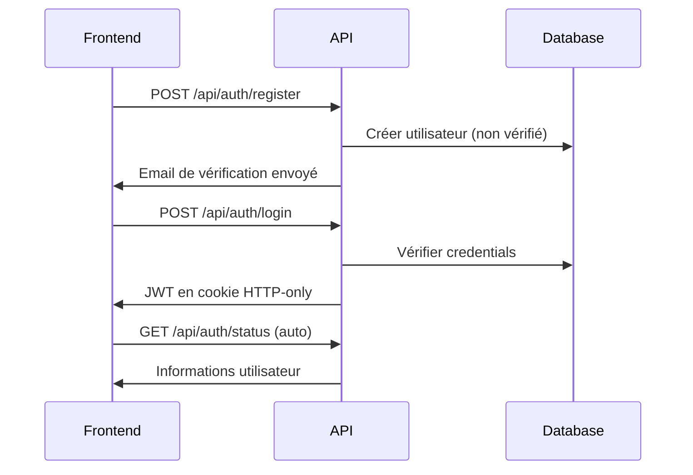

# ⚡ Electricity Business

**Plateforme complète de gestion de stations de recharge électrique**


## 📋 Vue d'ensemble

**Electricity Business** est une plateforme complète et moderne dédiée à la gestion d'un écosystème de stations de recharge pour véhicules électriques. Le projet offre une solution end-to-end où les propriétaires de stations peuvent mettre leurs bornes à disposition et où les propriétaires de véhicules électriques peuvent facilement rechercher et réserver des créneaux de recharge.

### 🎯 Objectif du projet

Révolutionner l'accès à la recharge électrique en créant un écosystème connecté qui :
- **Simplifie la gestion** des stations de recharge pour les propriétaires
- **Facilite la recherche et réservation** de créneaux pour les utilisateurs
- **Optimise l'utilisation** des infrastructures de recharge existantes
- **Démocratise l'accès** à la mobilité électrique

### 🏗️ Architecture du projet

Le projet est composé de **deux applications principales** :

```
electricity-business/
├── electricity-business-back/    # API REST - Backend Spring Boot
└── electricity-business-front/   # Interface utilisateur - Frontend React
```

## 🚀 Fonctionnalités principales

### 🔐 Système d'authentification complet
- **Inscription sécurisée** avec vérification d'email obligatoire
- **Authentification JWT** via cookies HTTP-only sécurisés
- **Gestion des rôles** (Utilisateur, Administrateur)
- **Protection contre les comptes bannis** et non vérifiés

### 👥 Gestion multi-utilisateurs
- **Profils utilisateur** personnalisables et complets
- **Système de permissions** granulaire selon les rôles
- **Interface administrateur** pour la supervision de la plateforme
- **Tableaux de bord** adaptés aux différents types d'utilisateurs

### 🚗 Écosystème véhicules électriques
- **Catalogue exhaustif** de modèles de véhicules électriques
- **Gestion des véhicules personnels** avec caractéristiques techniques
- **Base de données** des spécifications (autonomie, puissance de charge)
- **Intégration** avec les données de recharge optimales

### 📍 Gestion géospatiale des stations
- **Recherche géolocalisée** des stations proches avec MongoDB
- **Gestion complète** des lieux et stations de recharge
- **Interface propriétaire** intuitive pour administrer ses bornes
- **Visualisation en temps réel** des disponibilités

### 📅 Système de réservation intelligent
- **Réservation de créneaux** avec validation des disponibilités
- **Suivi en temps réel** des sessions de recharge
- **États avancés** : programmée, en cours, terminée, annulée
- **Système d'évaluation** et de retours d'expérience
- **Historique complet** pour utilisateurs et propriétaires

### 🔍 Recherche avancée et disponibilités
- **Recherche par créneaux horaires** pour trouver les stations libres
- **Filtres intelligents** (type de borne, puissance, prix)
- **Disponibilités en temps réel** avec mises à jour automatiques
- **Suggestions personnalisées** basées sur le véhicule de l'utilisateur

## 🛠️ Stack technique complète

### 🎯 Backend - API REST (Spring Boot)
- **Java 21** avec Eclipse Temurin
- **Spring Boot 3.5.3** (Web, Security, Data JPA, Data MongoDB)
- **Spring Security** avec authentification JWT
- **MySQL 8.3** - Données relationnelles (utilisateurs, véhicules, réservations)
- **MongoDB 7.0** - Données géospatiales (stations de recharge)
- **MapStruct** pour le mapping DTO/Entity automatique
- **Maven** pour la gestion des dépendances et build

### 🎨 Frontend - Interface utilisateur (React)
- **React 19.1.1** avec hooks modernes
- **Vite 7.2.4** pour un développement ultra-rapide
- **React Router DOM 7.9.5** avec protection des routes
- **Bootstrap 5.3.8** pour un design responsive
- **Context API** pour la gestion d'état globale
- **Hooks personnalisés** pour la logique métier réutilisable

### 🐳 DevOps & Déploiement
- **Docker & Docker Compose** - Conteneurisation backend avec bases de données
- **Vite Build** - Build optimisé du frontend pour production
- **Configurations par environnement** (dev, preprod, prod)
- **Base H2** intégrée pour le développement rapide

## 🚀 Démarrage rapide

### Prérequis système
- **Java 21+** (OpenJDK recommandé)
- **Node.js 18+** avec npm
- **Maven 3.9+**
- **Docker & Docker Compose** (pour preprod/prod)
- **MongoDB** (local pour dev, conteneurisé pour prod)

### 🔧 Installation complète

```bash
# 1. Cloner le projet principal
git clone https://github.com/LaiPe/electricity-business.git
cd electricity-business

# 2. Mise à jour des sous-modules
git submodule update --init --recursive

# 3. Démarrage backend (terminal 1)
cd electricity-business-back
mvn spring-boot:run "-Dspring-boot.run.profiles=dev"

# 4. Installation et démarrage frontend (terminal 2)
cd ../electricity-business-front
npm install
npm run dev
```

### 🌐 Accès aux applications

| Application | URL de développement | Description |
|-------------|---------------------|-------------|
| **Frontend** | http://localhost:5173 | Interface utilisateur React |
| **Backend API** | http://localhost:8080/api | API REST Spring Boot |
| **H2 Console** | http://localhost:8080/h2-console | Base de données de développement |
| **Health Check** | http://localhost:8080/actuator/health | Status de l'API |

### ⚡ Démarrage avec Docker par composant

```bash
# Backend avec Docker (dans electricity-business-back/)
cd electricity-business-back
docker-compose up -d

# Pour la production backend
docker-compose -f docker-compose.prod.yml up -d
```

**Note :** Le frontend React est servi via Vite en développement ou build statique en production.

## 📁 Structure du projet

```
electricity-business/
├── README.md                           # Documentation principale du projet
├── electricity-business-back/          # 🎯 Backend API Spring Boot
│   ├── src/main/java/                 # Code source Java
│   │   └── com/laipe/electricitybusiness/
│   │       ├── config/                # Configuration sécurité, CORS, JWT
│   │       ├── controller/            # Controllers REST avec validation
│   │       ├── dto/                   # Data Transfer Objects
│   │       ├── model/                 # Entités JPA et MongoDB  
│   │       ├── repository/            # Repositories JPA et MongoDB
│   │       ├── service/               # Logique métier
│   │       └── utils/                 # Utilitaires (JWT, validation)
│   ├── src/main/resources/            # Fichiers de configuration
│   │   ├── application-{env}.properties # Config par environnement
│   │   └── data/                      # Données d'initialisation
│   ├── docker-compose.yml             # Configuration pré-production
│   ├── docker-compose.prod.yml        # Configuration production
│   ├── Dockerfile                     # Image Docker de l'API
│   └── pom.xml                        # Configuration Maven
│
└── electricity-business-front/         # 🎨 Frontend React
    ├── src/                           # Code source React
    │   ├── components/                # Composants réutilisables
    │   │   ├── form/                  # Composants de formulaire
    │   │   └── spinner/               # Indicateurs de chargement
    │   ├── contexts/                  # Contextes React (Auth, Listes)
    │   ├── hooks/                     # Hooks personnalisés (API, Listes)
    │   ├── layouts/                   # Composants de mise en page
    │   ├── pages/                     # Pages de l'application
    │   │   ├── auth/                  # Authentification
    │   │   ├── navigation/            # Pages d'erreur et navigation
    │   │   └── *.jsx                  # Pages principales
    │   ├── utils/                     # Utilitaires (API client)
    │   ├── Router.jsx                 # Configuration du routage
    │   └── main.jsx                   # Point d'entrée
    ├── package.json                   # Dépendances npm
    └── vite.config.js                 # Configuration Vite
```

## 🔐 Sécurité et authentification

### 🛡️ Architecture de sécurité
- **JWT stockés en cookies HTTP-only** pour une sécurité maximale
- **Hashage BCrypt** pour tous les mots de passe
- **CORS configuré** strictement pour les domaines autorisés
- **Validation des données** à tous les niveaux (frontend et backend)
- **Protection CSRF** via la configuration des cookies

### 👥 Système de rôles et permissions

| Rôle | Permissions | Accès Frontend | Accès API |
|------|-------------|----------------|-----------|
| **Anonyme** | Consultation publique | Pages d'accueil, connexion | Endpoints publics |
| **Non vérifié** | En attente de validation | Pages de vérification | Endpoints de base |
| **Utilisateur** | Gestion complète de ses ressources | Toutes fonctionnalités utilisateur | Endpoints utilisateur |
| **Banni** | Accès restreint | Page d'information | Déconnexion uniquement |
| **Admin** | Supervision complète | Interface d'administration | Tous endpoints |

### 🔄 Flux d'authentification sécurisé



## 🌍 Environnements et déploiement

### 🔧 Configuration multi-environnements

| Environnement | Backend | Frontend | Base de données | Usage |
|---------------|---------|----------|-----------------|-------|
| **Développement** | `localhost:8080` | `localhost:5173` (Vite) | H2 + MongoDB local | Développement quotidien |
| **Pré-production** | Docker Compose | Build statique | MySQL + MongoDB (Docker) | Tests d'intégration |
| **Production** | Container Registry | Serveur web statique | Cluster MySQL/MongoDB | Déploiement final |

### 🐳 Déploiement Docker

**Backend (dans electricity-business-back/) :**
```bash
# Pré-production
docker-compose up -d

# Production
docker-compose -f docker-compose.prod.yml up -d

# Services inclus : backend, mysql, mongodb
```

**Frontend (dans electricity-business-front/) :**
```bash
# Build pour production
npm run build

# Le frontend génère des fichiers statiques dans dist/
# À servir via un serveur web (nginx, apache, etc.)
```

### 📊 Monitoring et santé

**Endpoints de monitoring disponibles :**
- `GET /actuator/health` - État de l'API
- `GET /actuator/metrics` - Métriques de performance
- Logs détaillés configurés par environnement
- Health checks Docker intégrés

## 🔗 Intégration et API

### 📡 Documentation des endpoints

L'API REST offre une couverture complète des fonctionnalités :

| Groupe | Endpoints | Fonctionnalités |
|--------|-----------|-----------------|
| **Authentication** | `/api/auth/*` | Login, register, logout, vérification de statut |
| **Users** | `/api/users/*` | Gestion des profils et informations utilisateur |
| **Vehicles** | `/api/vehicles/*` | Catalogue de modèles et véhicules personnels |
| **Places** | `/api/places/*` | Création et gestion des lieux de recharge |
| **Stations** | `/api/stations/*` | CRUD des stations avec recherche géospatiale |
| **Bookings** | `/api/bookings/*` | Système complet de réservation et évaluation |

**Documentation détaillée :** [ENDPOINTS.md](electricity-business-back/ENDPOINTS.md)

### 🔄 Communication Frontend-Backend

```javascript
// Configuration automatique dans ApiRequest.js
const apiCall = async (endpoint, options = {}) => {
  return fetch(`${API_URL}${endpoint}`, {
    credentials: 'include',      // Cookies automatiques
    headers: {
      'Content-Type': 'application/json',
      ...options.headers
    },
    ...options
  });
};
```

**Fonctionnalités intégrées :**
- ✅ Gestion automatique des cookies JWT
- ✅ Retry automatique en cas d'échec temporaire
- ✅ Loading states synchronisés avec l'interface
- ✅ Gestion d'erreurs centralisée avec messages utilisateur
- ✅ Support complet des codes de statut HTTP

## 🧪 Tests et qualité

### 🔍 Backend Testing
```bash
# Tests unitaires
mvn test

# Tests d'intégration
mvn verify

# Couverture de code
mvn jacoco:report
```

### 🎨 Frontend Quality
```bash
# Linting du code
npm run lint

# Build de validation
npm run build

# Preview de production
npm run preview
```

### 📊 Standards de qualité
- **Code coverage** minimum 70% pour le backend
- **ESLint** strict pour la qualité frontend
- **PropTypes** obligatoire pour tous les composants React
- **Validation des données** à tous les niveaux
- **Documentation** des fonctions complexes

## 🤝 Contribution

### 📋 Workflow de développement

1. **Fork** du projet depuis GitHub
2. **Clone local** avec sous-modules : `git clone --recurse-submodules`
3. **Branche feature** : `git checkout -b feature/nom-fonctionnalite`
4. **Développement** en suivant les standards du projet
5. **Tests locaux** complets (backend + frontend)
6. **Commit** avec messages explicites
7. **Push** et **Pull Request** avec description détaillée

### ⚙️ Configuration de développement

**Variables d'environnement nécessaires :**

Backend (`application-dev.properties`) :
```properties
# Base de données de développement
spring.datasource.url=jdbc:h2:mem:testdb
spring.data.mongodb.database=electricity_business_dev

# Configuration JWT
jwt.secret=your-development-jwt-secret
jwt.expiration=86400000
```

Frontend (`.env`) :
```env
# URL de l'API de développement
VITE_API_URL=http://localhost:8080/api

# Environnement
VITE_ENV=dev
```

### 🔧 Outils de développement recommandés

**IDE et extensions :**
- **IntelliJ IDEA** ou **VS Code** pour le backend Java
- **VS Code** avec extensions React pour le frontend
- **Postman** ou **Insomnia** pour tester l'API
- **MongoDB Compass** pour visualiser les données géospatiales

**Extensions VS Code recommandées :**
- ES7+ React/Redux/React-Native snippets
- Auto Rename Tag
- Bracket Pair Colorizer
- Extension Pack for Java

## 📚 Documentation et ressources

### 📖 Documentation complète du projet

| Document | Emplacement | Description |
|----------|-------------|-------------|
| **README Principal** | `/README.md` | Vue d'ensemble du projet complet |
| **Backend README** | `/electricity-business-back/README.md` | Documentation de l'API Spring Boot |
| **Frontend README** | `/electricity-business-front/README.md` | Documentation de l'interface React |
| **Documentation API** | `/electricity-business-back/ENDPOINTS.md` | Détails de tous les endpoints |
| **Guide des environnements** | `/electricity-business-back/ENVIRONNEMENTS.md` | Configuration par environnement |

### 🎓 Ressources d'apprentissage

**Technologies utilisées :**
- [Spring Boot Documentation](https://spring.io/projects/spring-boot)
- [React Documentation](https://react.dev/)
- [MongoDB Geospatial Queries](https://docs.mongodb.com/manual/geospatial-queries/)
- [JWT Best Practices](https://auth0.com/blog/a-look-at-the-latest-draft-for-jwt-bcp/)
- [Docker Compose Guide](https://docs.docker.com/compose/)

### 🆘 Support et assistance

**En cas de problème :**

1. **Vérifier la documentation** correspondant au composant concerné
2. **Consulter les logs** :
   - Backend : Logs Spring Boot dans la console
   - Frontend : Console du navigateur (F12)
3. **Tester les endpoints** directement via l'API
4. **Ouvrir une issue** avec :
   - Description détaillée du problème
   - Étapes de reproduction
   - Environnement utilisé (dev/preprod/prod)
   - Logs d'erreur complets

**Contacts :**
- **Issues GitHub** pour les bugs et demandes de fonctionnalités
- **Documentation** pour les questions d'utilisation
- **Code source** pour comprendre l'implémentation

## 📄 Licence et remerciements

### 📋 Licence
Ce projet est distribué sous **licence MIT**. Voir le fichier `LICENSE` pour les détails complets.

### 🙏 Remerciements
- **Communauté Spring Boot** pour l'écosystème robuste
- **Équipe React** pour les innovations constantes
- **MongoDB** pour les capacités géospatiales
- **Communauté open source** pour l'inspiration et les outils

---

## 🚀 Démarrez dès maintenant !

```bash
# Clone du projet complet
git clone --recurse-submodules https://github.com/LaiPe/electricity-business.git
cd electricity-business

# Démarrage rapide en développement
# Terminal 1 - Backend
cd electricity-business-back && mvn spring-boot:run "-Dspring-boot.run.profiles=dev"

# Terminal 2 - Frontend  
cd electricity-business-front && npm install && npm run dev

# Accédez à l'application : http://localhost:5173
```

**Développé avec ❤️ par [LaiPe](https://github.com/LaiPe) pour accélérer la transition vers la mobilité électrique**

---

*⚡ **Electricity Business** - Connecter l'avenir de la mobilité électrique, une recharge à la fois.*